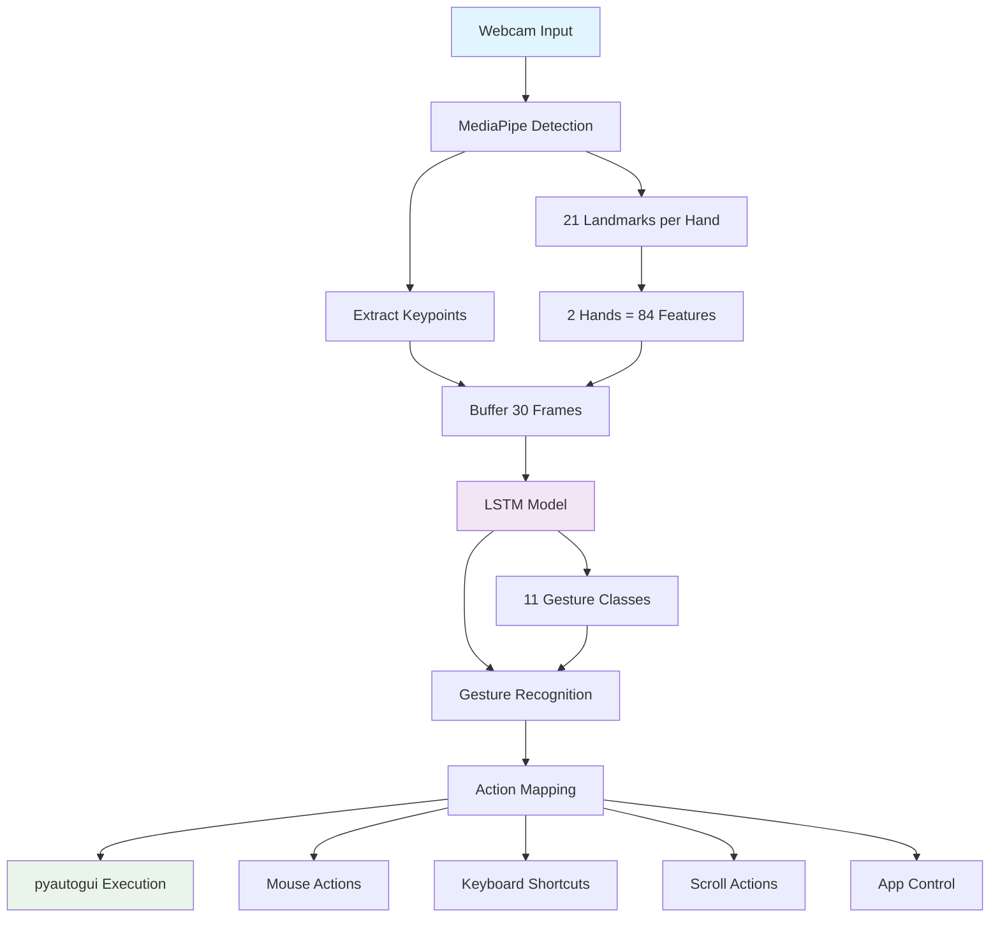

# Hệ Thống Điều Khiển Máy Tính Bằng Cử Chỉ Tay

## Tổng Quan

Đây là một hệ thống nhận diện cử chỉ tay thông minh sử dụng **MediaPipe** để phát hiện tay và **mô hình LSTM** để nhận diện cử chỉ, cho phép điều khiển máy tính thông qua webcam. Hệ thống hỗ trợ 11 loại cử chỉ khác nhau và có thể thực hiện các hành động như di chuyển chuột, click, cuộn trang, chuyển tab, phóng to/thu nhỏ, và mở ứng dụng.

## Kiến Trúc Hệ Thống



### Luồng Xử Lý Chi Tiết

1. **Webcam Input**: Thu thập video real-time từ webcam
2. **MediaPipe Detection**: Phát hiện tay và trích xuất 21 landmarks cho mỗi tay
3. **Extract Keypoints**: Chuẩn hóa keypoints thành 84 features (42 × 2 tay)
4. **Buffer 30 Frames**: Lưu trữ 30 frame liên tiếp để tạo sequence
5. **LSTM Model**: Mô hình Bidirectional LSTM nhận diện cử chỉ
6. **Gesture Recognition**: Dự đoán 1 trong 11 loại cử chỉ
7. **Action Mapping**: Chuyển đổi cử chỉ thành hành động cụ thể
8. **pyautogui Execution**: Thực thi hành động trên hệ thống

## Các Cử Chỉ Được Hỗ Trợ

| Cử Chỉ | Hành Động | Loại | Mô Tả |
|--------|-----------|------|-------|
| `clickchuotphai` | Click chuột phải | Discrete | Giơ 1 ngón tay, di chuyển và dừng |
| `clickchuottrai` | Click chuột trái | Discrete | Giơ 1 ngón tay, di chuyển và dừng |
| `dichuyenchuot` | Di chuyển chuột | Continuous | Giơ 1 ngón tay, di chuyển tay |
| `dungchuongtrinh` | Dừng chương trình | Discrete | Giơ nắm tay |
| `mochorme` | Mở Chrome | Discrete | Giơ 5 ngón tay, mở rộng bàn tay |
| `phongto` | Phóng to (Ctrl +) | Discrete | Giơ 2-3 ngón tay, di chuyển lên |
| `thunho` | Thu nhỏ (Ctrl -) | Discrete | Giơ 2-3 ngón tay, di chuyển xuống |
| `vuotlen` | Cuộn lên (2 ngón tay) | Continuous | Giơ 2 ngón tay, di chuyển lên |
| `vuotxuong` | Cuộn xuống (2 ngón tay) | Continuous | Giơ 2 ngón tay, di chuyển xuống |
| `vuotphai` | Tab tiếp theo (Ctrl + Tab) | Continuous | Giơ 2 ngón tay, di chuyển phải |
| `vuottrai` | Tab trước (Ctrl + Shift + Tab) | Continuous | Giơ 2 ngón tay, di chuyển trái |

### Phân Loại Cử Chỉ

#### Cử Chỉ Discrete (Tức Thì)
- Thực hiện một lần khi nhận diện
- Có delay 0.2 giây giữa các lần thực hiện
- Bao gồm: click, mở app, phóng to/thu nhỏ, dừng chương trình

#### Cử Chỉ Continuous (Liên Tục)
- Thực hiện liên tục khi giữ cử chỉ
- Không có delay, phản hồi real-time
- Bao gồm: di chuyển chuột, cuộn trang, chuyển tab

## Cấu Trúc Thư Mục

```
HocMay/
├── Main/                    # Module chính của chương trình
│   ├── Actions.py          # Xử lý các hành động điều khiển
│   ├── Detection.py        # Phát hiện tay và trích xuất keypoints
│   ├── Main.py            # File chạy chính
│   └── Model.py           # Load model và dự đoán cử chỉ
├── Train/                  # Huấn luyện mô hình
│   └── LSTM_Train.ipynb   # Notebook huấn luyện LSTM
├── Create_Dataset/         # Tạo dataset từ video
│   └── create_dataset.ipynb # Notebook tạo dataset
├── dataset/                # Dữ liệu đã xử lý
│   ├── X.npy              # Features (sequences)
│   ├── y.npy              # Labels
│   └── label_encoder.npy  # Label encoder
├── videotrain/            # Video huấn luyện
│   ├── clickchuotphai/
│   ├── clickchuottrai/
│   ├── dichuyenchuot/
│   └── ... (11 thư mục cử chỉ)
├── gesture_lstm_model.h5  # Mô hình đã huấn luyện
└── README.md              # Tài liệu này
```

## Yêu Cầu Hệ Thống

### Thư Viện Python
```bash
# Cài đặt tất cả dependencies
pip install mediapipe tensorflow opencv-python pyautogui scikit-learn numpy matplotlib seaborn

# Hoặc cài đặt từng thư viện
pip install mediapipe==0.10.21
pip install tensorflow==2.19.0
pip install opencv-python==4.11.0.86
pip install pyautogui==0.9.54
pip install scikit-learn==1.6.1
pip install numpy==1.26.4
pip install matplotlib==3.10.0
pip install seaborn==0.13.2
```

### Phần Cứng
- **Webcam**: Hỗ trợ 2 tay, độ phân giải tối thiểu 640x480
- **Python**: 3.7+ (khuyến nghị 3.8+)
- **RAM**: Tối thiểu 4GB (khuyến nghị 8GB+)
- **CPU**: Intel i5+ hoặc AMD Ryzen 5+
- **GPU**: Tùy chọn (CUDA cho TensorFlow)

### Hệ Điều Hành
- **Windows**: 10/11 (khuyến nghị)
- **macOS**: 10.15+ (có thể cần cài đặt thêm)
- **Linux**: Ubuntu 18.04+ (có thể cần cài đặt thêm)

## Cài Đặt Chi Tiết

### 1. Cài Đặt Python
```bash
# Windows (sử dụng Python từ python.org)
# Tải và cài đặt Python 3.8+ từ https://python.org

# macOS (sử dụng Homebrew)
brew install python@3.8

# Linux (Ubuntu/Debian)
sudo apt update
sudo apt install python3.8 python3-pip
```

### 2. Tạo Virtual Environment
```bash
# Tạo virtual environment
python -m venv gesture_env

# Kích hoạt (Windows)
gesture_env\Scripts\activate

# Kích hoạt (macOS/Linux)
source gesture_env/bin/activate
```

### 3. Cài Đặt Dependencies
```bash
# Cài đặt tất cả thư viện
pip install -r requirements.txt

# Hoặc cài đặt thủ công
pip install mediapipe tensorflow opencv-python pyautogui scikit-learn numpy matplotlib seaborn
```

### 4. Kiểm Tra Cài Đặt
```python
# Test script
import cv2
import mediapipe as mp
import tensorflow as tf
import pyautogui
import numpy as np

print("OpenCV:", cv2.__version__)
print("MediaPipe:", mp.__version__)
print("TensorFlow:", tf.__version__)
print("PyAutoGUI:", pyautogui.__version__)
print("NumPy:", np.__version__)

# Test webcam
cap = cv2.VideoCapture(0)
if cap.isOpened():
    print("Webcam: OK")
    cap.release()
else:
    print("Webcam: ERROR")
```

## Troubleshooting

### 1. Lỗi Webcam
```python
# Lỗi: "Không mở được webcam!"
# Giải pháp:
cap = cv2.VideoCapture(0)  # Thử index 0, 1, 2...
if not cap.isOpened():
    cap = cv2.VideoCapture(1)  # Thử camera khác
```

### 2. Lỗi MediaPipe
```python
# Lỗi: "No module named 'mediapipe'"
# Giải pháp:
pip install mediapipe
# Hoặc
pip install --upgrade mediapipe
```

### 3. Lỗi TensorFlow
```python
# Lỗi: "No module named 'tensorflow'"
# Giải pháp:
pip install tensorflow
# Hoặc cho GPU:
pip install tensorflow-gpu
```

### 4. Lỗi PyAutoGUI
```python
# Lỗi: "PyAutoGUI fail-safe triggered"
# Giải pháp:
pyautogui.FAILSAFE = False  # Tắt fail-safe
# Hoặc di chuyển chuột đến góc màn hình
```

### 5. Lỗi Model
```python
# Lỗi: "Không tìm model tại ../gesture_lstm_model.h5"
# Giải pháp:
# 1. Kiểm tra file model có tồn tại
# 2. Chạy notebook Train/LSTM_Train.ipynb để tạo model
# 3. Copy file model vào thư mục gốc
```

### 6. Lỗi Performance
```python
# Lỗi: FPS thấp, lag
# Giải pháp:
# 1. Giảm resolution webcam
# 2. Tăng confidence threshold
# 3. Sử dụng GPU cho TensorFlow
# 4. Đóng các ứng dụng khác
```

## Hướng Dẫn Sử Dụng

### 1. Chạy Chương Trình Chính

```bash
cd Main
python Main.py
```

**Lưu ý:** Đảm bảo file `gesture_lstm_model.h5` có trong thư mục gốc.

### 2. Cách Sử Dụng

1. **Mở webcam**: Chương trình sẽ tự động mở webcam
2. **Thực hiện cử chỉ**: Giơ tay trước webcam và thực hiện cử chỉ mong muốn
3. **Xem kết quả**: Cử chỉ được nhận diện sẽ hiển thị trên màn hình
4. **Thoát**: Nhấn phím 'q' để thoát chương trình

### 3. Các Loại Cử Chỉ

#### Cử Chỉ Discrete (Tức Thì)
- **Click chuột trái/phải**: Giơ 1 ngón tay, di chuyển và dừng
- **Mở Chrome**: Giơ 5 ngón tay, mở rộng bàn tay
- **Phóng to/Thu nhỏ**: Giơ 2-3 ngón tay, di chuyển lên/xuống
- **Dừng chương trình**: Giơ nắm tay

#### Cử Chỉ Continuous (Liên Tục)
- **Di chuyển chuột**: Giơ 1 ngón tay, di chuyển tay
- **Cuộn trang**: Giơ 2 ngón tay, di chuyển lên/xuống
- **Chuyển tab**: Giơ 2 ngón tay, di chuyển trái/phải

## Chi Tiết Kỹ Thuật

### 1. Phát Hiện Tay (Detection.py)

```python
# Cấu hình MediaPipe
MP_HANDS_CONFIG = {
    'static_image_mode': False,
    'max_num_hands': 2,                    # Hỗ trợ 2 tay
    'min_detection_confidence': 0.7,       # Ngưỡng phát hiện
    'min_tracking_confidence': 0.5         # Ngưỡng theo dõi
}
```

**Tính năng chính:**
- Phát hiện tối đa 2 tay
- Trích xuất 21 landmarks cho mỗi tay
- Tính toán center và số ngón tay duỗi
- Normalize keypoints theo bounding box

### 2. Mô Hình LSTM (Model.py)

```python
# Cấu hình mô hình
N_FRAMES = 30          # Số frame trong sequence
FEATURES = 84          # 42 features × 2 tay
CONF_THRESHOLD = 0.5   # Ngưỡng tin cậy
```

**Kiến trúc mô hình:**
- **Input**: (30, 84) - 30 frame, 84 features
- **LSTM Bidirectional**: 128 units → 64 units
- **Dense layers**: 64 → 32 → 11 classes
- **Activation**: Softmax cho classification

### 3. Xử Lý Hành Động (Actions.py)

```python
# Cấu hình hành động
SCROLL_SENSITIVITY = 3.0    # Độ nhạy cuộn
SMOOTH_ALPHA = 0.5          # Độ mượt di chuyển chuột
TAB_THRESHOLD = 0.05        # Ngưỡng chuyển tab
DISCRETE_DELAY = 0.2        # Delay cho cử chỉ discrete
```

**Các loại hành động:**
- **Mouse actions**: Di chuyển, click
- **Keyboard shortcuts**: Ctrl+Tab, Ctrl+Shift+Tab
- **Scroll actions**: Cuộn với 2 ngón tay
- **Application control**: Mở Chrome, phóng to/thu nhỏ

## Huấn Luyện Mô Hình

### 1. Tạo Dataset

Chạy notebook `Create_Dataset/create_dataset.ipynb`:

```python
# Xử lý video từ thư mục videotrain/
# Mỗi video được chia thành sequences 30 frame
# Trích xuất 84 features (42 × 2 tay)
```

### 2. Huấn Luyện LSTM

Chạy notebook `Train/LSTM_Train.ipynb`:

```python
# Làm sạch dữ liệu
# Xây dựng mô hình Bidirectional LSTM
# Huấn luyện với callbacks
# Đánh giá và lưu mô hình
```

**Kết quả huấn luyện:**
- **Test Accuracy**: 100%
- **Test Loss**: 0.0013
- **Precision/Recall/F1**: 1.00 cho tất cả classes

## Tối Ưu Hóa

### 1. Hiệu Suất
- **Buffer size**: 30 frames (cân bằng độ chính xác/tốc độ)
- **Confidence threshold**: 0.5 (giảm false positive)
- **Smoothing**: Alpha = 0.5 (mượt mà di chuyển chuột)

### 2. Độ Chính Xác
- **Data cleaning**: Loại bỏ sequences có >70% frames không detect tay
- **Class balancing**: Undersample majority classes
- **Normalization**: Scale features về [0,1]

### 3. Trải Nghiệm Người Dùng
- **Visual feedback**: Hiển thị landmarks, bbox, labels
- **Color coding**: Tay 1 (xanh), Tay 2 (đỏ)
- **Real-time display**: FPS counter, buffer status

## Xử Lý Lỗi

### 1. Lỗi Thường Gặp

```python
# Lỗi không mở được webcam
if not cap.isOpened():
    print("Không mở được webcam!")
    exit(1)

# Lỗi không tìm thấy model
if not os.path.exists(MODEL_PATH):
    print(f"Không tìm model tại {MODEL_PATH}!")
    exit(1)
```

### 2. Debug Mode

```python
# Hiển thị thông tin debug
print(f"Buffer: {len(sequence_buffer)}/30")
print(f"Detected: {gesture_label} (Conf: {confidence:.2f})")
print(f"Mouse: ({mouse_x}, {mouse_y})")
```

## Mở Rộng

### 1. Thêm Cử Chỉ Mới

1. **Tạo video mẫu** trong thư mục `videotrain/`
2. **Cập nhật GESTURES** trong `Model.py`
3. **Thêm action mapping** trong `Actions.py`
4. **Huấn luyện lại mô hình**

### 2. Cải Thiện Độ Chính Xác

- **Tăng dataset**: Thêm video huấn luyện
- **Data augmentation**: Xoay, scale, noise
- **Model architecture**: Thêm layers, attention mechanism
- **Ensemble methods**: Kết hợp nhiều mô hình

### 3. Tích Hợp Ứng Dụng

- **Voice commands**: Kết hợp với speech recognition
- **Eye tracking**: Điều khiển bằng mắt
- **Multi-modal**: Kết hợp cử chỉ + giọng nói

## Kết Luận

Hệ thống điều khiển máy tính bằng cử chỉ tay này cung cấp một giao diện tự nhiên và trực quan để tương tác với máy tính. Với độ chính xác cao (100% trên test set) và hỗ trợ 11 loại cử chỉ khác nhau, hệ thống có thể được sử dụng trong nhiều ứng dụng thực tế như:

- **Accessibility**: Hỗ trợ người khuyết tật
- **Gaming**: Điều khiển game bằng tay
- **Presentation**: Điều khiển slide thuyết trình
- **Smart home**: Điều khiển thiết bị thông minh

Hệ thống được thiết kế modular và dễ dàng mở rộng, cho phép thêm các cử chỉ mới và tích hợp với các ứng dụng khác một cách linh hoạt.

---

**Tác giả**: [Trần Văn Hoàng]  
**Ngày tạo**: 14/10/2025
**Phiên bản**: 1.0  
**License**: MIT
